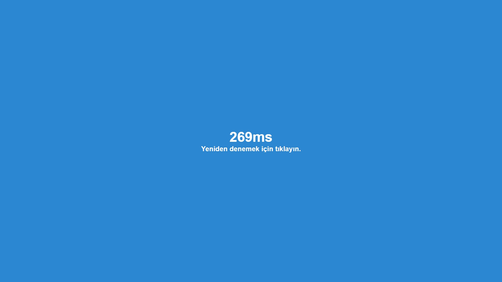

# Reaksiyon Hızı Testi

Bu JavaScript uygulaması, kullanıcının reaksiyon hızını ölçmek için basit bir test sunar.
Kullanıcıdan ekrana tıklanması istenir ve tıkladığı anda geçen süre ölçülerek reaksiyon hızı hesaplanır.

## Nasıl Çalışır

1. https://vedategunduz.github.io/reactiontest/ ziyaret edin.
2. Testi başlatmak için ekrana tıklayın.
3. Yeşil renkli kutucuğun ortaya çıkmasını bekleyin.
4. Yeşil kutucuğu gördüğünüz anda, mümkün olan en hızlı şekilde ekrana tıklayın.
5. Reaksiyon süreniz ekranda gösterilecektir.

## Dosya Yapısı

- `/index.html`: Uygulamanın HTML dosyası.
- `assets/css/style.css`: Uygulamanın CSS dosyası.
- `assets/js/script.js`: Uygulamanın JavaScript dosyası.

## Gereksinimler

Bu uygulama için herhangi bir harici bağımlılık gerekmez. Ancak, JavaScript'in etkin olduğu bir tarayıcı gereklidir.

## Ekran Görüntüleri

